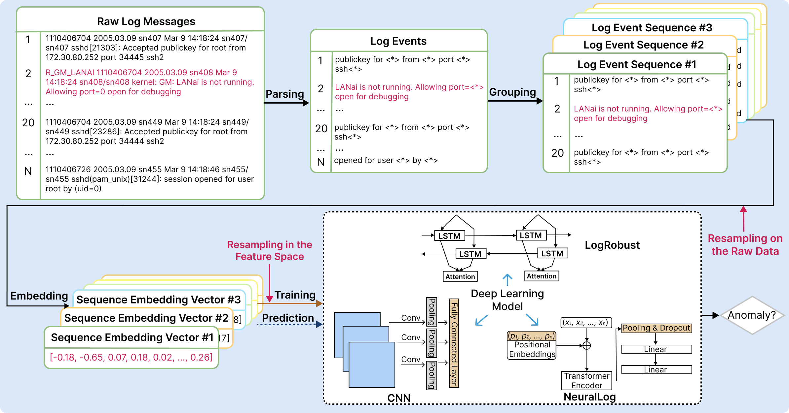

# ResamplingEmpirical

Repository for the paper: On the Influence of Data Resampling for Deep Learning-Based Anomaly Detection: Insights and Recommendations.

**Abstract**: 
Numerous Deep Learning (DL)-based approaches have garnered considerable attention in the field of software
anomaly detection (AD). However, a practical challenge persists: The prevalent issue of class imbalance in the
public data commonly used to train the DL models. This imbalance is characterized by a substantial disparity
in the number of abnormal log sequences compared to normal ones, for example, anomalies represent less
than 1% of one of the most popular datasets, namely the Thunderbird dataset.

Previous research has indicated that existing DLAD approaches may exhibit unsatisfactory performance,
particularly when confronted with datasets featuring severe class imbalances. Mitigating class imbalance
through data resampling has proven effective for other software engineering tasks, however it has been
unexplored for AD thus far.

This study aims to fill this gap by providing an in-depth analysis of the impact of diverse data resampling
methods on existing DLLAD approaches from two distinct perspectives. Firstly, we assess the performance
of these DLLAD approaches across three datasets, and explore the impact of resampling ratios of normal to
abnormal data on ten data resampling methods. Secondly, we evaluate the effectiveness of the data resampling
methods when utilizing optimal resampling ratios of normal to abnormal data. Our findings indicate that
oversampling methods generally outperform undersampling and hybrid sampling methods. Data resampling
on raw data yields superior results compared to data resampling in the feature space. In most cases, certain
undersampling and hybrid methods (e.g., SMOTEENN and InstanceHardnessThreshold) show limited effec-
tiveness. Additionally, by exploring the resampling ratio of normal to abnormal data, we suggest generating
more data for minority classes through oversampling while removing less data from majority classes through
undersampling.

In conclusion, our study provides valuable insights into the intricate relationship between data resampling
techniques and DLAD. By addressing the challenge of class imbalance, researchers and practitioners can
enhance the performance of DLAD approaches in anomaly detection tasks.

## Framwork of DLAD Models
The typical workflow of DLAD approaches consists of four phases: 1) log parsing, 2) log grouping, 3) log embedding, and 4) model training and prediction.
<p align="center"><br>The Common Workflow of DLAD Approaches</p>

## Data 
The datasets used for training and evaluation are from three publicly available datasets: BGL, Thunderbird and Spirit. The raw logs can be downloaded at https://www.usenix.org/cfdr-data.

For a detailed description of the datasets, please refer to the [DSN'07 paper](https://ieeexplore.ieee.org/document/4273008) by Adam Oliner and Jon Stearley.
<p align="center"><br>Statistics of the three public datasets</p>

Here are the initial and final proportions of sequence anomalies before and after employing resampling techniques.
<p align="center"><br>Statistics after over-/under-/hybrid sampling the original data</p>


## Demo
In this work, we investigate the influence of eleven sampling methods on the performance of three DLAD approaches, namely [CNN](https://ieeexplore.ieee.org/document/8511880), [LogRobust](https://dl.acm.org/doi/10.1145/3338906.3338931) and [NeuralLog](https://www.computer.org/csdl/proceedings-article/ase/2021/033700a492/1AjSXBpYSuk).

### Data Preparation
1. Download three datasets and put them under the folder ./dataset.
2. Name the datasets according to their names (i.e. bgl, Spirit and Thunderbird).
3. Parse the raw logs via [Drain](https://ieeexplore.ieee.org/document/8029742) parser with default parameters setting before running CNN and LogRobust.
```shell
$ cd LogADEmpirical/preprocess
$ python parser.py
```
4. Download the pretrained word vector from [fastText](https://fasttext.cc/docs/en/english-vectors.html). Put the downloaded file under ./dataset and name it as 'nlp-word.vec'.
5. Compute and store the word embeddings for each dataset. Please change the parameter setting accordingly.
```shell
$ cd LogADEmpirical
$ python get_embedding.py
```
 

### CNN
Example of running CNN on BGL with fixed window size of 20 and SMOTE as the sampling method:
```shell
$ cd LogADEmpirical
$ python --folder=bgl/ --semantics  --log_file=BGL.log --dataset_name=bgl --model_name=cnn --window_type=sliding --sample=sliding_window --is_logkey --train_size=0.8 --train_ratio=1 --valid_ratio=0.1 --test_ratio=1 --sampling_method=SMOTE  --sampling_ratio=0.25 --max_epoch=20 --n_warm_up_epoch=0 --n_epochs_stop=10 --batch_size=64 --num_candidates=150 --history_size=10 --lr=0.001 --accumulation_step=5 --session_level=entry --window_size=20 --step_size=20 --output_dir=results/ --is_process
```

### LogRobust
Example of running LogRobust on BGL with fixed window size of 20 and SMOTE as the sampling method:
```shell
$ cd LogADEmpirical
$ python --folder=bgl/ --semantics  --log_file=BGL.log --dataset_name=bgl --model_name=logrobust --window_type=sliding --sample=sliding_window --is_logkey --train_size=0.8 --train_ratio=1 --valid_ratio=0.1 --test_ratio=1 --sampling_method=SMOTE  --sampling_ratio=0.25 --max_epoch=20 --n_warm_up_epoch=0 --n_epochs_stop=10 --batch_size=64 --num_candidates=150 --history_size=10 --lr=0.001 --accumulation_step=5 --session_level=entry --window_size=20 --step_size=20 --output_dir=results/ --is_process
```

### NeuralLog
Example of running NeuralLog on BGL with fixed window size of 20 and SMOTE as the sampling method:
```shell
$ cd NeuralLog/demo
$ python NeuralLog.py --max_epoch=20 --batch_size=64 --window_size=20 --step_size=20 --sampling_method=SMOTE  --sampling_ratio=0.25 --model_file=bgl_transformer.hdf5
```

For more explanation of parameters:
```shell script
python main_run.py --help
```
Or
```shell script
python NeuralLog.py --help
```

## Results
Here are the evaluation results under different data resampling techniques (i.e., NoSampling (NS), SMOTE (SMO), ADASYN (ADA), NearMiss (NM), InstanceHardnessThreshold (IHT), SMOTEENN (SE), SMOTETomek (ST), RandomOverSampling in the feature space (ROS<sub>F</sub>), RandomUnderSampling in the feature space (RUS<sub>F</sub>), RandomOverSampling applied to raw data (ROS<sub>R</sub>), and RandomUnderSampling applied to raw data (RUS<sub>R</sub>)). <br>
These tables use color-coding to emphasize the cases that resampling methods improve model performance.
<p align="center"><br>The Recall, Precision, Specificity, F1-score, MCC, and AUC values of CNN when employing various data
resampling techniques</p>
<p align="center"><br>The Recall, Precision, Specificity, F1-score, MCC, and AUC values of LogRobust when employing various data
resampling techniques</p>
<p align="center"><br>The Recall, Precision, Specificity, F1-score, MCC, and AUC values of NeuralLog when employing various data
resampling techniques</p>
