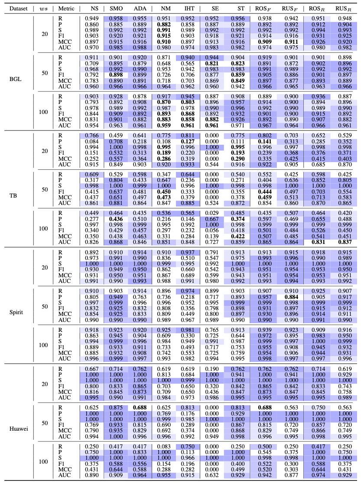
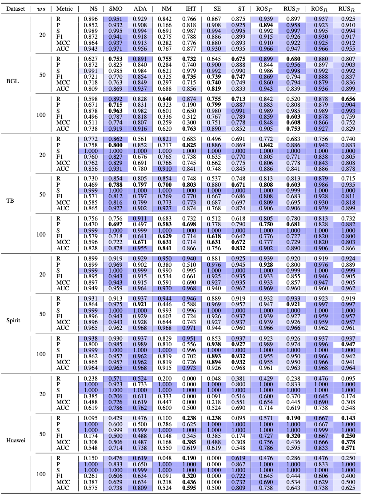

# ResamplingEmpirical

Repository for the paper: On the Influence of Data Resampling for Deep Learning-Based Log Anomaly Detection: Insights and Recommendations.

**Abstract**: 
Numerous Deep Learning (DL)-based approaches have gained attention in software Log Anomaly Detection (LAD), yet class imbalance in training data remains a challenge, with anomalies often comprising less than 1\% of datasets like Thunderbird. Existing DLLAD methods may underperform in severely imbalanced datasets. Although data resampling has proven effective in other software engineering tasks, it has not been explored in LAD. This study aims to fill this gap by providing an in-depth analysis of the impact of diverse data resampling methods on existing DLLAD approaches from two distinct perspectives. Firstly, we assess the performance of these DLLAD approaches across four datasets with different levels of class imbalance, and we explore the impact of resampling ratios of normal to abnormal data on DLLAD approaches. Secondly, we evaluate the effectiveness of the data resampling methods when utilizing optimal resampling ratios of normal to abnormal data. Our findings indicate that oversampling methods generally outperform undersampling and hybrid sampling methods. Data resampling on raw data yields superior results compared to data resampling in the feature space. These improvements are attributed to the increased attention given to important tokens. By exploring the resampling ratio of normal to abnormal data, we suggest generating more data for minority classes through oversampling while removing less data from majority classes through undersampling. In conclusion, our study provides valuable insights into the intricate relationship between data resampling methods and DLLAD. By addressing the challenge of class imbalance, researchers and practitioners can enhance DLLAD performance.

## Framwork of DLLAD Models
The typical workflow of DLLAD approaches consists of four phases: 1) log parsing, 2) log grouping, 3) log embedding, and 4) model training and prediction.
<p align="center"><br>The common workflow of DLLAD approaches.</p>

## Data 
The datasets used for training and evaluation are from four publicly available datasets: BGL, Thunderbird, Spirit and Huawei Cloud. 

The raw logs for BGL, Thunderbird and Spirit can be downloaded from https://www.usenix.org/cfdr-data. </br>The Huawei Cloud data processed by Drain parser can be downloaded from https://zenodo.org/records/7609780. The aggregated Huawei.log can be found in the ./docs folder.

For a detailed description of the datasets, please refer to the [DSN'07 paper](https://ieeexplore.ieee.org/document/4273008) paper for BGL, Thunderbird and Spirit, and the [Hades](https://ieeexplore.ieee.org/document/10172782) paper for Huawei Cloud.
<p align="center"><br>The statistics of the four public datasets. TB, ws, Msg, Seq, and A are the abbreviations of the Thunderbird dataset, window sizes, Messages, Sequences, and Anomalies, respectively.</p>
<p align="center"><br>Log variety in the datasets:  E<sub>n</sub>, and E<sub>a</sub> denote the number of unique normal and abnormal log events; S<sub>n/a</sub>(20), S<sub>n/a</sub> (50), and S<sub>n/a</sub> (100) denote the number of unique normal/abnormal log sequences grouped by varying window sizes.</p>


Here are the initial and final proportions of sequence anomalies before and after employing resampling techniques.
<p align="center"><br>The anomaly proportions before and after over-/under-/hybrid sampling. r denotes the original ratio of normal to abnormal log sequences in the training dataset, and quarter-based constants are represented as 1/4, 1/2, and 3/4. The last nine columns correspond to the anomaly proportions after data resampling.</p>


## Demo
In this work, we investigate the influence of ten sampling methods on the performance of three DLLAD approaches, namely [CNN](https://ieeexplore.ieee.org/document/8511880), [LogRobust](https://dl.acm.org/doi/10.1145/3338906.3338931) and [NeuralLog](https://www.computer.org/csdl/proceedings-article/ase/2021/033700a492/1AjSXBpYSuk).

### Data Preparation
1. Download the four datasets and put them under the folder ./dataset.
2. Name the datasets according to their names (i.e. bgl, Spirit and Thunderbird).
3. Parse the raw logs via [Drain](https://ieeexplore.ieee.org/document/8029742) parser with default parameters setting before running CNN and LogRobust.
```shell
$ cd LogADEmpirical/preprocess
$ python parser.py
```
4. Download the pretrained word vector from [fastText](https://fasttext.cc/docs/en/english-vectors.html). Put the downloaded file under ./dataset and name it as 'nlp-word.vec'.
5. Compute and store the word embeddings for each dataset. Please change the parameter setting accordingly.
```shell
$ cd LogADEmpirical
$ python get_embedding.py
```
 

### CNN
Example of running CNN on BGL with fixed window size of 20 and SMOTE as the sampling method:
```shell
$ cd LogADEmpirical
$ python main_run.py --folder=bgl/ --semantics  --log_file=BGL.log --dataset_name=bgl --model_name=cnn --window_type=sliding --sample=sliding_window --is_logkey --train_size=0.8 --train_ratio=1 --valid_ratio=0.1 --test_ratio=1 --sampling_method=SMOTE  --sampling_ratio=0.25 --max_epoch=20 --n_warm_up_epoch=0 --n_epochs_stop=10 --batch_size=64 --num_candidates=150 --history_size=10 --lr=0.001 --accumulation_step=5 --session_level=entry --window_size=20 --step_size=20 --output_dir=results/ --is_process
```

### LogRobust
Example of running LogRobust on BGL with fixed window size of 20 and SMOTE as the sampling method:
```shell
$ cd LogADEmpirical
$ python main_run.py --folder=bgl/ --semantics  --log_file=BGL.log --dataset_name=bgl --model_name=logrobust --window_type=sliding --sample=sliding_window --is_logkey --train_size=0.8 --train_ratio=1 --valid_ratio=0.1 --test_ratio=1 --sampling_method=SMOTE  --sampling_ratio=0.25 --max_epoch=20 --n_warm_up_epoch=0 --n_epochs_stop=10 --batch_size=64 --num_candidates=150 --history_size=10 --lr=0.001 --accumulation_step=5 --session_level=entry --window_size=20 --step_size=20 --output_dir=results/ --is_process
```

### NeuralLog
Example of running NeuralLog on BGL with fixed window size of 20 and SMOTE as the sampling method:
```shell
$ cd NeuralLog/demo
$ python NeuralLog.py --max_epoch=20 --batch_size=64 --window_size=20 --step_size=20 --sampling_method=SMOTE  --sampling_ratio=0.25 --model_file=bgl_transformer.hdf5
```

For more explanation of parameters:
```shell script
python main_run.py --help
```
Or
```shell script
python NeuralLog.py --help
```

## Results
Here are the evaluation results under different data resampling techniques (i.e., NoSampling (NS), SMOTE (SMO), ADASYN (ADA), NearMiss (NM), InstanceHardnessThreshold (IHT), SMOTEENN (SE), SMOTETomek (ST), RandomOverSampling in the feature space (ROS<sub>F</sub>), RandomUnderSampling in the feature space (RUS<sub>F</sub>), RandomOverSampling applied to raw data (ROS<sub>R</sub>), and RandomUnderSampling applied to raw data (RUS<sub>R</sub>)). <br>

These tables use color-coding to emphasize the cases that resampling methods improve model performance. Darker cells signify superior performance, while various colors denote statistical significance among data resampling methods for each evaluation metric (determined by the Scott-Knott ESD test with a p-value<0.05), as observed in the subsequent tables.
<p align="center"><br>The Recall, Precision, Specificity, F1-score, MCC, and AUC values of CNN when employing various data resampling methods to the four datasets, each with three different window sizes.</p>
<p align="center"><br>The Recall, Precision, Specificity, F1-score, MCC, and AUC values of LogRobust when employing various data resampling methods to the four datasets, each with three different window sizes.</p>
<p align="center"><br>The Recall, Precision, Specificity, F1-score, MCC, and AUC values of NeuralLog when employing various data resampling methods to the four datasets, each with three different window sizes.</p>
