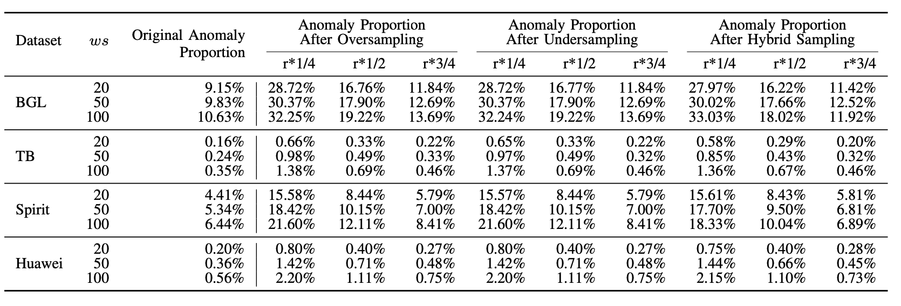
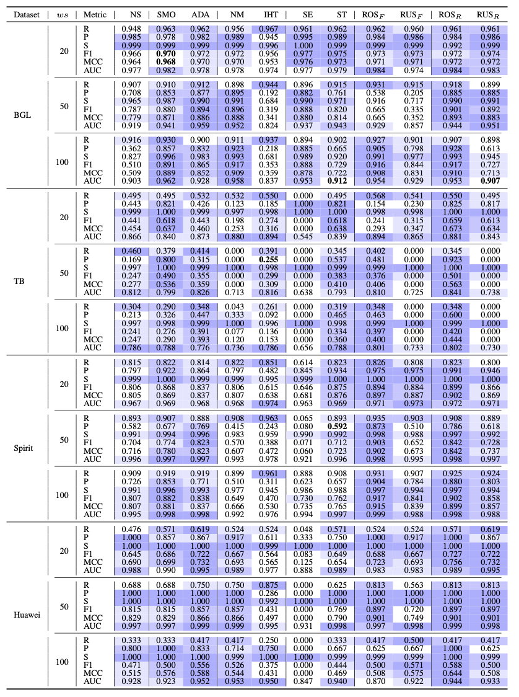

# ResamplingEmpirical

Repository for the paper: Examining the Influence of Data Resampling Techniques on Deep Learning-Based Anomaly Detection: Insights and Recommendations.

**Abstract**: 
Many Deep Learning (DL)-based approaches have gained prominence in anomaly detection (AD). However, a practical challenge still exists: The prevalent issue of class imbalance in commonly used public data. This imbalance manifests as a substantial disparity in the number of abnormal log sequences compared to normal ones, like anomalies typically account for less than 1% of Thunderbird dataset. Prior research has indicated that state-of-the-art (SOTA) DLAD approaches may exhibit unsatisfactory performance, particularly when confronted with datasets with severe class imbalances. To address this challenge, mitigating class imbalance through data resampling is effective and has been demonstrated in various Software Engineering (SE) tasks. In this comprehensive study, we delve deeply into the impact of diverse data resampling techniques on DLAD approaches from two distinct aspects. First, we assess the performance of DLAD approaches and evaluate the effectiveness of data resampling techniques on those approaches when utilizing predefined desired ratios of normal to abnormal data. Second, we explore the implications of varying desired ratios within different resampling categories, accompanied by practical recommendations. Our findings indicate that, on the whole, oversampling techniques outperform undersampling and hybrid sampling techniques, and simple random sampling directly applied to raw data exhibits superior performance compared to other techniques conducted in the feature space. Interestingly, undersampling methods do not effectively alleviate the data imbalance issue. To maximize the effectiveness of resampling for DLAD approaches, we recommend adopting an oversampling method with a lower desired ratio, thereby narrowing the gap between the counts of normal and abnormal data instances by creating more minority data. For undersampling methods, we recommend employing a larger desired ratio, that is, mitigating the disparity between the quantities of the two classes while reducing information loss. Overall, our study offers valuable insights into the intricate relationship between data resampling techniques and DLAD.

## Framwork of DLAD Models
The typical workflow of DLAD approaches consists of four phases: 1) log parsing, 2) log grouping, 3) log embedding, and 4) model training and prediction.
<p align="center"><br>The Common Workflow of DLAD Approaches</p>

## Demo
In this work, we investigate the influence of eleven sampling methods on the performance of three DLAD approaches, namely [CNN](https://ieeexplore.ieee.org/document/8511880), [LogRobust](https://dl.acm.org/doi/10.1145/3338906.3338931) and [NeuralLog](https://www.computer.org/csdl/proceedings-article/ase/2021/033700a492/1AjSXBpYSuk).
```shell
```

## Data 
The datasets used for training and evaluation are from three publicly available datasets: BGL, Thunderbird and Spirit. The raw logs can be downloaded at https://www.usenix.org/cfdr-data.

For a detailed description of the datasets, please refer to the [DSN'07 paper](https://ieeexplore.ieee.org/document/4273008) by Adam Oliner and Jon Stearley.
<p align="center"><br>Statistics of the three public datasets</p>

Here are the initial and final proportions of sequence anomalies before and after employing resampling techniques.
<p align="center"><br>Statistics after over-/under-/hybrid sampling the original data</p>


## Results
Here are the evaluation results under different data resampling techniques (i.e., NoSampling (NS), SMOTE (SMO), ADASYN (ADA), NearMiss (NM), InstanceHardnessThreshold (IHT), SMOTEENN (SE), SMOTETomek (ST), RandomOverSampling in the feature space (ROS<sub>F</sub>), RandomUnderSampling in the feature space (RUS<sub>F</sub>), RandomOverSampling applied to raw data (ROS<sub>R</sub>), and RandomUnderSampling applied to raw data (RUS<sub>R</sub>)). <br>
These tables use color-coding to emphasize the cases that resampling methods improve model performance.
<p align="center"><br>The Recall, Precision, Specificity, F1-score, MCC values of CNN when employing various data
resampling techniques</p>
<p align="center"><br>The Recall, Precision, Specificity, F1-score, MCC values of LogRobust when employing various data
resampling techniques</p>
<p align="center"><br>The Recall, Precision, Specificity, F1-score, MCC values of NeuralLog when employing various data
resampling techniques</p>